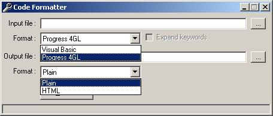



## VB to HTML syntax hilighter

### Description

Inspired by the sudden "explosion" of syntax hilighters around here I decided to roll my own, just to see how it would turn out. This is an extensible Object Oriented approach to syntax hilighting with very easy-to-read sourcecode. By default the program uses the CSS emitter, which generates colors using the included CSS file, you can switch it to use  tags of you can write your own emitter with little to no effort. The parser and emitter parts of the code are completely distinct.

Right now it parses keywords, numbers, comments, strings and plain text, have fun with it, it's certainly somewhat more useful than some of the other hilighter examples I've encountered here.

Updated new version, new features:

- Supports Progress 4GL as well as Visual Basic

- Command line parameters for scriptability

- Will expand and uppercase abbreviated keywords in P4GL

- Added Plaintext emitter

- Some general code cleanup and improvement
 
### More Info
 

             |
---                |---
**Submitted On**   |2004-07-23 13:53:26
**By**             |[Gerco Dries](https://github.com/Planet-Source-Code/PSCIndex/blob/master/ByAuthor/gerco-dries.md)
**Level**          |Intermediate
**User Rating**    |4.6 (23 globes from 5 users)
**Compatibility**  |VB 5\.0, VB 6\.0
**Category**       |[Internet/ HTML](https://github.com/Planet-Source-Code/PSCIndex/blob/master/ByCategory/internet-html__1-34.md)
**World**          |[Visual Basic](https://github.com/Planet-Source-Code/PSCIndex/blob/master/ByWorld/visual-basic.md)
**Archive File**   |[VB\_to\_HTML18113910282004\.zip](https://github.com/Planet-Source-Code/gerco-dries-vb-to-html-syntax-hilighter__1-39850/archive/master.zip)

